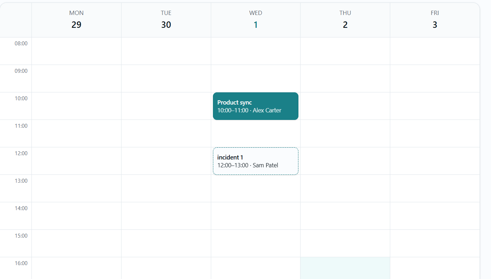
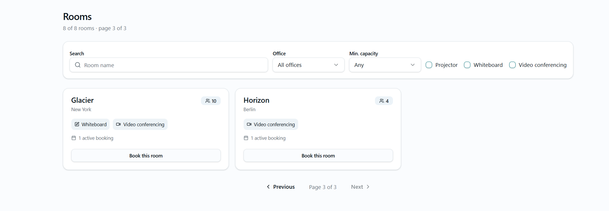
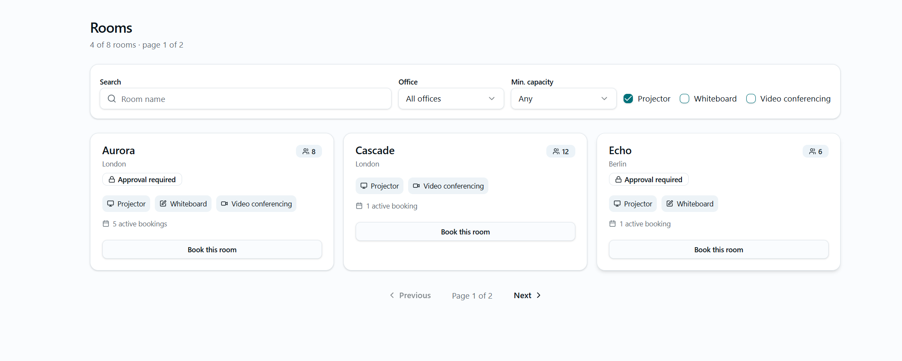
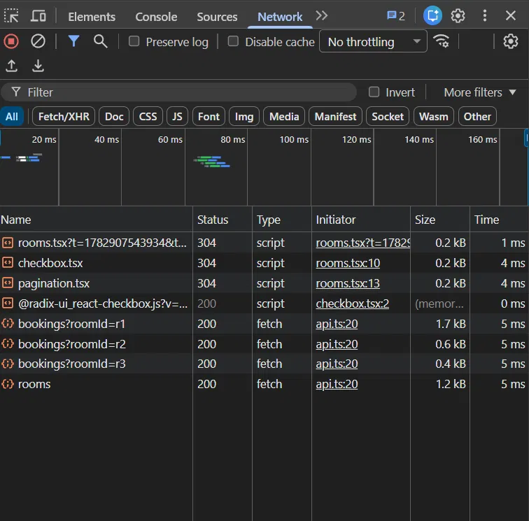
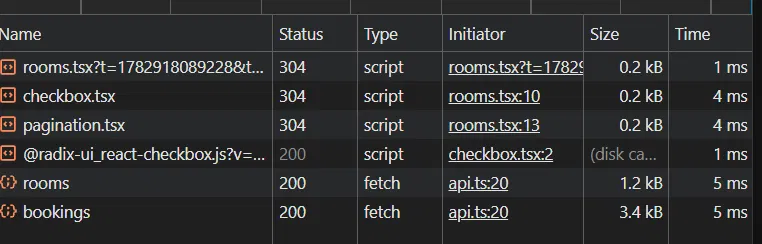

# Roomly Phase 2 Incident Fixes

For this phase, the repo that was used was the finished product from phase 1, not the original repo. For each of the incidents, the following things were done:
1. Reproduce the error
2. Find the root cause
3. Make minimal fixes
4. Verification of the fix

## Incident 1 (Bookings vanish from the calendar after requesting approval) 

For this incident, it was said that when making a request for a room which requires approval, won't show up on the calendar. On my phase 1 branch I could not reproduce this, as pending bookings do display accordingly and correctly, because this issue was already addressed within Phase 1.

### 1. Reproduction
To try and display the error as mentioned, the following steps were taken:
1. Book a room which requires approval
2. found the exact room and week on the calendar, which the booking would be in
3. pending booking displays as expected, at the correct time and date.
4. tried different times 1-3 with difference of also accepting it, rejecting it, amending it, or just completely cancelling, and all behaviour was as expected correct

### 2. Root cause
In the original code, the calendar query filtered to **status : "confirmed"** only, meaning that pending bookings were excluded and appeared to vanish after the approval was requested.

### 3. Resolution
Already fixed within Phase 1, the calendar query no longer filters to confirmed bookings, but instead it also includes pending bookings (**confirmed || pending**) shown in a different style to the confirmed ones. This results in no further change needed.

### 4. Verification
Pending bookings show as expected on the calendar:




## Incident 2 (Double booking)
For this incident it was said that two users (or two concurrent requests) can book the same room at the same time.

### 1. Reproduction of the error
To display the error as mentiond, two identical requests were sent concurrently through the console of the browser:
```js
const body = JSON.stringify({ roomId: "r1", title: "Race A",
  start: "2026-07-01T10:00:00.000Z", end: "2026-07-01T11:00:00.000Z", attendees: 2 });
Promise.all([
  fetch("/api/bookings", { method: "POST", headers: {"Content-Type":"application/json"}, body }),
  fetch("/api/bookings", { method: "POST", headers: {"Content-Type":"application/json"}, body }),
]).then(rs => Promise.all(rs.map(r => r.status))).then(console.log);
```
before the fix, both of the requests returned 201, as well as bookings.json having both of the requests as bookings. It could be seen it was these requests because of the timestamp being the same, as well as room, title, etc.

### 2. Root cause
It was found after some checking of the application before even trialing the console requests, that it wasn't a case of 2 users making a request at different timestamps for the same exact booking details, but rather a race condition. Because I realised that, i went to check the POST bookings request code, where I found the issue. The corresponding conflict check was done **outside** the lock, meaning that even 100 requests at the same time would pass into creating multiple bookings at the same time. The lock that was used was only protecting the writing of the booking to the database, hence why they would both still be accepted as one booking was written at a time. As can be seen, here is the code section with the incorrect code:

```js
const bookings = await readBookings();          // read unlocked
const conflict = findConflict(bookings, ...);   // check unlocked
if (conflict) return 409;
await updateBookings((current) => [...current, booking]);  // write locked
```


### 3. Fix
To fix the issue, I moved the conflict check inside the updataBookings callback, so the check and the write would happen together inside the file lock. The booking is still made outside of the lock so only the most critical parts are made within the lock section, not delaying the amount of time a request keeps using that lock. As can be seen, here's the final resulting code:
```js
let conflict = false;
await updateBookings((current) => {
  if (findConflict(current, start, end, roomId)) { conflict = true; return current; }
  return [...current, booking];
});
if (conflict) return c.json({ error: "Room is already booked for that time" }, 409);
```
This code works because the lock serializes the callback. Now when a request comes, it does all the checks and appends before releasing the lock for the next incoming request. If a booking with the same details comes in, it would return unchanged with error code 409.

### 4. Verification
After the fix, the same console code was written and the test returns **[201,409]** and bookings.json contains exactly one booking for the slot rather than two like previously. 
To verify further, a test has been added on test case **findConflict** where it catches an identical same-room slot, but the primary evidence would be the concurrent request through console.

### Note
the same lock issue existed in the **PATCH /bookings/:id** where it was for editing a booking's time. I applied the identical fix as with this incident, where I moved the conflict check inside the **update bookings**, ignoring the booking's own id so it doesn't clash with its current slot. 

## Incident 3 (rejected slot showing occupied)
For this incident, it was said that when a booking is rejected, it still shows as occupied. 

### 1. Reproduction of the error
To allow for the reproduction of this error, what I done is the following:
1. created a booking with a room that required approval.
2. rejected that corresponding booking
3. created a new booking with the same criteria, using all three sorts of accounts (employee, manager, admin)
4. confirmed it no longers appears on the calendar and instead the new booking shows up

### 2. Root cause
In the original code, **overlaps** was a blocklist that didn't treat **rejected** as non-blocking, so rejected bookings kept reserving their slot.

### 3. Resolution
As can be seen already from Phase 1, **overlaps** is an allowlist now, therefore only **pending** or **confirmed** block, and the calendar render filter excludes bookings with the status **rejected**. No further change was needed.

### 4. Verification
To verify this, an existing test inside **overlaps > ignores rejected bookings** is in place, proving rejected doesn't block, and the calendar filter excludes it from display.


## Incident 4 (wrong page after applying filter to rooms)
For this incident, it was said that when in the rooms pages, and say the user is at page 3, if a filter is applied, the page wouldn't refresh to the starting or corresponding page.

### 1. Reproduction of the error
To make the error appear through reproduction, what I done is the following:
1. Logged in with a user, and entered the Rooms page without applying any filters
2. Went to page 3, or last page that was currently available
3. Applied a filter, say that the room needed a projector.
4. Confirmed that the page would remain at number 3, instead of going to number 1 or 2 depending on the amount of rooms available for that filter.

### 2. Root cause
I understood that the problem came from the **rooms.tsx**. I'm still building depth in React, so I made sure with Claude I understood how component state and re-renders work here before changing anything rather than guessing. **page** is a component state that persists across filter changes. When a filter shrinks the result set, **totalPages** updates, but **page** stays put, resulting in the wrong page being displayed. The displayed rooms come from **rooms.slice((page-1) * PAGE_SIZE,page * PAGE_SIZE)**, meaning that when **page** is 3 but the filtered list only fills 2 pages, that slice starts past the end of the array, so it returns nothing, hence the empty page. Because this is a React component not updating accordingly, no error would show up on the console regarding it. 

### 3. Fix
To fix this issue, two solutions could have been used after the filter has been applied:
1. Displaying the last possible page within that filter, unless the number of pages expands or remains the same.
2. Display the first page from the set that is gathered from the filters applied.

In this scenario, to edit it with minimal changes, and also adhering with common UX, the second option was picked. It was done by adding a **useEffect** that resets page to 1 whenever any filter (q, office, minCap, equipment) has changed. This was done to centralise the reset in one place, so no filter can be added later without it.

### 4. Verification
As a result to the fix, the reproduction of the error was redone, and it worked as expected, making the user see page one again.

**Before filter**


**After filter**



# Incident 5 (room loads very slowly with many bookings)
For this incident, it was said that when being in the rooms page, and say many bookings were already placed, the room list would show up slowly each time. 

### 1. Reproduction of the error
To reproduce this error, what I done is i opened the network tab through the inspect, and saw that whenever going to a new page within the rooms section, it showed one **bookings?roomId=...** request per room card, meaning the complexity would be n+1. Each request would read the bookings all again on the server side, so it worsens as bookings grow.

### 2. Root cause
**RoomBookingCount** rendered per room card, each running its own **useBookings({ roomId })**.

### 3. Fix
Instead of each card fetching its own booking, I fetch all bookings once in the parent, and build a per room count map with **useMemo**, and passing each room's count to **RoomBookingCount**, so that it doesnt fetch anymore and instead just displays.

### 4. Verification
Network tab now shows a single **bookings** request instead of one per room:

**Before the fix**



**After the fix**



### Note
During this process, I also checked whether the number matched what was within the bookings.json file, where I noticed the count for each room was taking into account all the bookings apart from the **cancelled** ones. This means that rejected bookings also get counted in as active bookings. I kept this to keep the fix minimal, although rejected bookings and argubly even pending bookings shouldn't count.